---

### Control Plane

<table>
<tr>
<td width="55%" valign="top">

I build automation-heavy software: bot systems, background workers, dashboards, deployment glue, and real-time interfaces that turn repeated manual work into stable infrastructure.

My favorite kind of product feels boring in production: observable, repairable, and clear enough that future-me can still understand it at 3 AM.

</td>
<td width="45%" valign="top">

<pre>
operator   lyric-jl
focus      automation systems / bot infra
runtime    linux / docker / nginx
signal     small tools, sharp reliability
mode       ship, observe, simplify
</pre>

</td>
</tr>
</table>

---

### Active Modules

<table>
<tr>
<td width="33%" valign="top">

**Automation Core**

Workflow bots, schedulers, task runners, account systems, and the boring logic that removes repetitive work.

</td>
<td width="33%" valign="top">

**Ops Interface**

Admin dashboards, real-time panels, API surfaces, monitoring pages, and tooling for running systems without guessing.

</td>
<td width="33%" valign="top">

**Deployment Layer**

Dockerized services, Linux process management, Nginx routing, Redis/Postgres wiring, and production patch discipline.

</td>
</tr>
</table>

---

### Stack Matrix

 

---

### Telemetry

 

---

### Contribution Signal

<picture>
  <source media="(prefers-color-scheme: dark)" srcset="https://raw.githubusercontent.com/lyric-jl/lyric-jl/output/github-contribution-grid-snake-dark.svg" />
  <source media="(prefers-color-scheme: light)" srcset="https://raw.githubusercontent.com/lyric-jl/lyric-jl/output/github-contribution-grid-snake.svg" />
  
</picture>

---

quiet systems / sharp tools / production discipline

